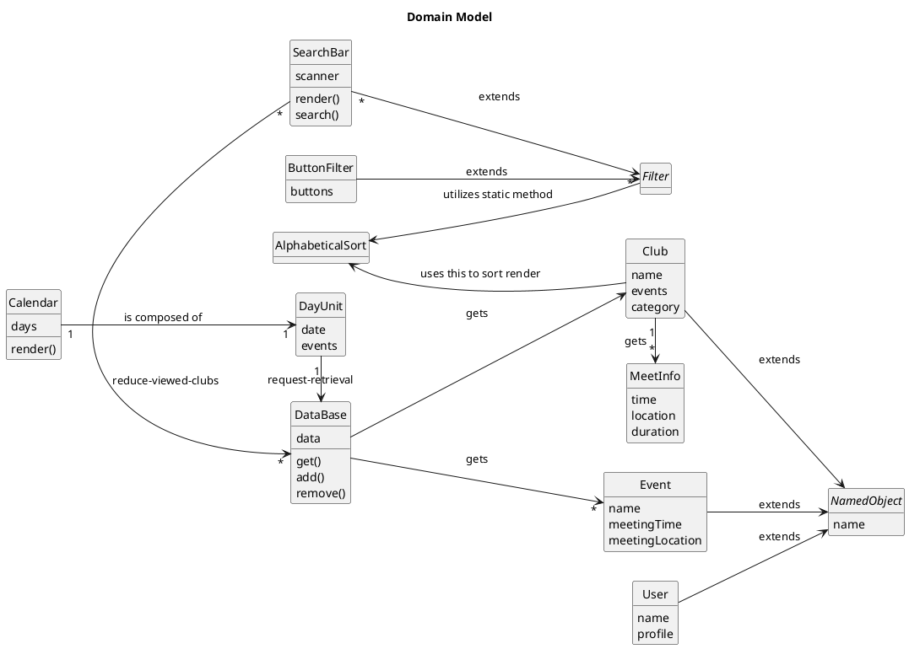
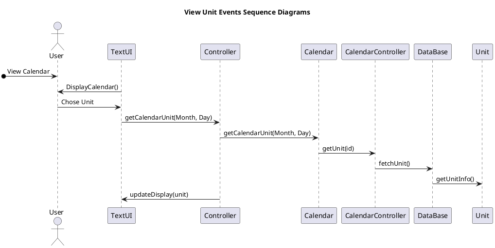

```plantuml
@startuml
left to right direction
hide circle
hide empty methods
title Domain Model

class SearchBar {
    scanner
    render()
    search()
}

abstract class Filter {

}

class ButtonFilter {
    buttons
}

class DataBase {
    data
    get()
    add()
    remove()
}

class Calendar {
    days 
    render()  
}

class DayUnit {
    date
    events
}

class Club {
    name
    events 
    category  
}

class MeetInfo {
    time
    location
    duration
}

class Event {
    name
    meetingTime
    meetingLocation
}

abstract class NamedObject {
    name 
}

class AlphabeticalSort {

}
class User {
    name
    profile
}


'associations
SearchBar "*" -down-> "*" Filter:\t extends 
SearchBar "*"-right->"*" DataBase: \t reduce-viewed-clubs \t\t
ButtonFilter -down-> Filter: \t extends\t\t
DataBase -> Club:\t gets \t\t
DataBase -down-> "*" Event:\t gets \t\t
Club "1" -> "*" MeetInfo:\t gets \t\t
Calendar "1" -down-> "1" DayUnit:\t is composed of \t\t
DayUnit "1" -left-> DataBase: \t request-retrieval\t\t
Club -down-> NamedObject: \t extends\t
User -down-> NamedObject: \t extends\t
Event -down-> NamedObject: \t extends\t
Filter -up-> AlphabeticalSort: \t utilizes static method\t
Club -up-> AlphabeticalSort: \t uses this to sort render\t\t


@enduml
```

```plantuml
@startuml
title View Unit Events Sequence Diagrams
actor "User" as user
participant "TextUI" as ui
participant "Controller" as control
participant "Calendar" as cal
participant "CalendarController" as calcontrol
participant "DataBase" as data
participant "Unit" as unit

[o-> user: View Calendar
user <- ui: DisplayCalendar()
user -> ui: Chose Unit
ui -> control: getCalendarUnit(Month, Day)
control -> cal: getCalendarUnit(Month, Day)
cal -> calcontrol : getUnit(id)
calcontrol -> data : fetchUnit()
data -> unit : getUnitInfo()
ui <- control : updateDisplay(unit)
@enduml
```