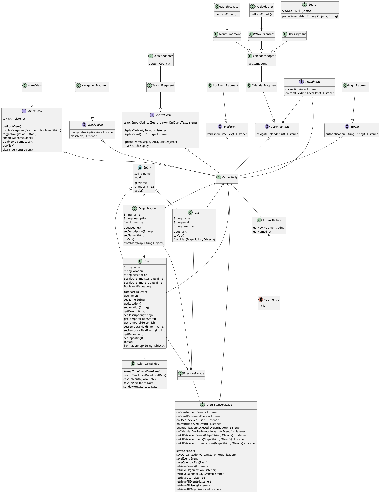

```plantuml
@startuml
@startuml
'Entity
abstract Entity {
String name
int id

getName()
changeName()
getId()
}

'User
class User {
String name
String email
String password

getEmail()
toMap()
fromMap(Map<String, Object>)
}

'Organization
class Organization {
String name
String description
Event meeting

getMeeting()
setDescription(String)
setName(String)
toMap()
fromMap(Map<String,Object>)
}

'Event
class Event {
String name
String location
String description
LocalDateTime startDateTime
LocalDateTime endDateTime
Boolean ifRepeating

compareTo(Event)
getName()
setName(String)
getLocation()
setLocation(String)
getDescription()
setDescription(String)
getTemporalFieldStart ()
getTemporalFieldFinish ()
setTemporalFieldStart (int, int)
setTemporalFieldFinish (int, int)
getRepeating()
setRepeating()
toMap()
fromMap(Map<String, Object>)
}

'Search

class Search{
ArrayList<String> keys;

partialSearch(Map<String, Object>, String)
}

'Controller
class MainActivity {
}

'FragmentID
Enum FragmentID {
int id
}

'EnumUtilities
class EnumUtilities {
getNewFragmentID(int)
getName(int)
}

'CalendarUtilities
class CalendarUtilities {
formatTime(LocalDateTime)
monthYearFromDate(LocalDate)
daysInMonth(LocalDate)
daysInWeek(LocalDate)
sundayForDate(LocalDate)
}

interface IHomeView {
toNav() - Listener

getRootView()
displayFragment(Fragment, boolean, String)
toggleNavigationButton()
enableWelcomeLabel()
disableWelcomeLabel()
popNav()
clearFragmentScreen()
}

interface INavigation{
navigateNavigation(int)- Listener
closeNav()- Listener
}

interface ISearchView {
searchInput(String, ISearchView) - OnQueryTextListener

displayClub(int, String) - Listener
displayEvent(int, String) - Listener

updateSearchDisplay(ArrayList<Object>)
clearSearchDisplay()
}

interface IAddEvent {
void showTimePick() - Listener
}

interface ICalendarView {
navigateCalendar(int) - Listener
}

interface IMonthView{
clickAction(int) - Listener
onItemClick(int, LocalDate) - Listener
}

interface ILogin{
authentication (String, String) - Listener
}

class CalendarAdapter{
getItemCount()
}

class MonthAdapter {
getItemCount ()
}

class WeekAdapter {
getItemCount ()
}

class SearchAdapter{
getItemCount ()
}

class IPersistanceFacade {
onEventAdded(Event) - Listener
onEventRemoved(Event) - Listener
onUserRecieved(User) - Listener
onEventRecieved(Event) - Listener
onOrganizationRecieved(Organization) - Listener
onCalendarDayRecieved(ArrayList<Event>) - Listener
onAllRetrievedEvents(Map<String, Object>) - Listener
onAllRetrievedUsers(Map<String, Object>) - Listener
onAllRetrievedOrganizations(Map<String, Object>) - Listener

saveUser(User)
saveOrganization(Organization organization)
saveEvent(Event)
saveCalendarDay(Even)
retrieveEvents(Listener)
retrieveOrganization(Listener)
retrieveCalendarDayEvents(Listener)
retrieveUser(Listener)
retrieveAllEvents(Listener)
retrieveAllUsers(Listener)
retrieveAllOrganizations(Listener)
}

'associations
MonthAdapter --> MonthFragment
WeekAdapter --> WeekFragment
DayFragment --|> CalendarAdapter
MonthFragment --|> CalendarAdapter
WeekFragment --|> CalendarAdapter
CalendarAdapter --> CalendarFragment
SearchAdapter --> SearchFragment
LoginFragment --|> ILogin
HomeView --|> IHomeView
NavigationFragment --|> INavigation
SearchFragment --|> ISearchView
AddEventFragment --|> IAddEvent
IMonthView --* ICalendarView

CalendarFragment --|> ICalendarView
ILogin <|-- MainActivity
IMonthView <|-- MainActivity
IHomeView <|-- MainActivity
INavigation <|-- MainActivity
ISearchView <|-- MainActivity
IAddEvent <|-- MainActivity
ICalendarView <|-- MainActivity

MainActivity <-- User
MainActivity <-- Event
MainActivity <-- Organization

MainActivity <-- EnumUtilities
EnumUtilities <-- FragmentID

Entity <|-- User
Entity <|-- Event
Entity <|-- Organization

Organization --* Event
Event --o CalendarUtilities

Organization --* FirestoreFacade
Event --* FirestoreFacade
User --* FirestoreFacade
FirestoreFacade --|> IPersistanceFacade
MainActivity --|> IPersistanceFacade
@enduml
```
