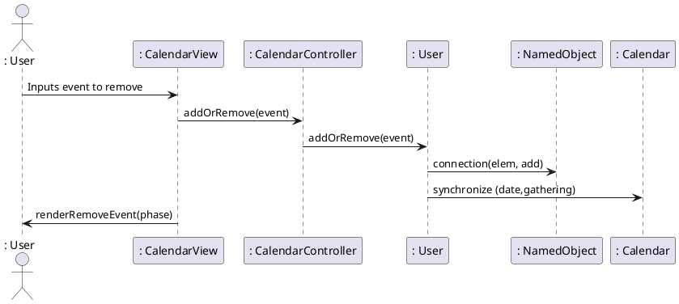

```plantuml
@startuml
actor ": User" as user
participant ": CalendarView" as calview
participant ": CalendarController" as calctrl
participant ": User" as usr
participant ": NamedObject" as name
participant ": Calendar" as cal

user -> calview : Inputs event to remove
calview -> calctrl:  addOrRemove(event)
calctrl -> usr : addOrRemove(event)
usr -> name: connection(elem, add)
usr -> cal : synchronize (date,gathering)
user <- calview : renderRemoveEvent(phase)
@enduml
```