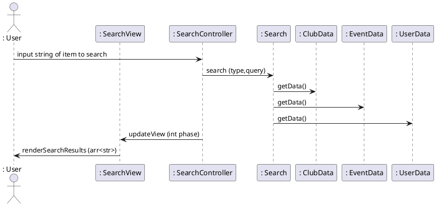

```plantuml
@startuml
actor ": User" as user
participant ": SearchView" as srchview
participant ": SearchController" as srchctrl
participant ": Search" as srch
participant ": ClubData" as clubD
participant ": EventData" as eventD
participant ": UserData" as userD

user -> srchctrl : input string of item to search
srchctrl -> srch : search (type,query)
srch -> clubD : getData()
srch -> eventD : getData()
srch -> userD : getData()
srchview <- srchctrl: updateView (int phase)
user <- srchview : renderSearchResults (arr<str>)
@enduml
```

