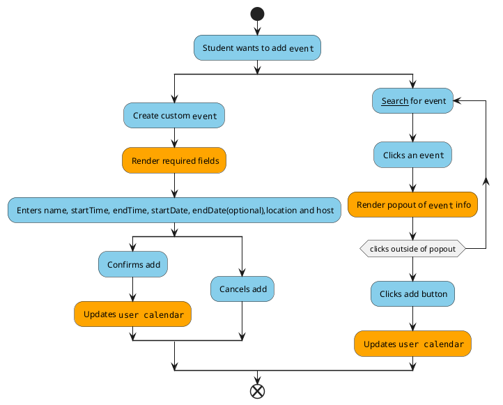

Blue: User, Orange: System

```plantuml
@startuml
start
#SkyBlue: Student wants to add ""event"";
split
    #SkyBlue: Create custom ""event"";
    #Orange: Render required fields;
    #SkyBlue: Enters name, startTime, endTime, startDate, endDate(optional),location and host;
split
    #SkyBlue: Confirms add;
    #Orange: Updates ""user calendar"";
split again
    #SkyBlue: Cancels add;
end split
split again
    #SkyBlue:repeat: __Search__ for event;
    #SkyBlue: Clicks an ""event"";
    #Orange: Render popout of ""event"" info;
    repeat while ( clicks outside of popout )
    #SkyBlue: Clicks add button;
    #Orange: Updates ""user calendar"";
end split
end
@enduml
```