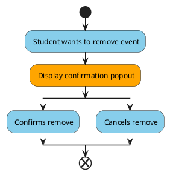

Blue: User, Orange: System

```plantuml
@startuml
start
#SkyBlue: Student wants to remove event;
#Orange: Display confirmation popout;
split
#SkyBlue: Confirms remove;
split again
#SkyBlue: Cancels remove;
end split
end
@enduml
```