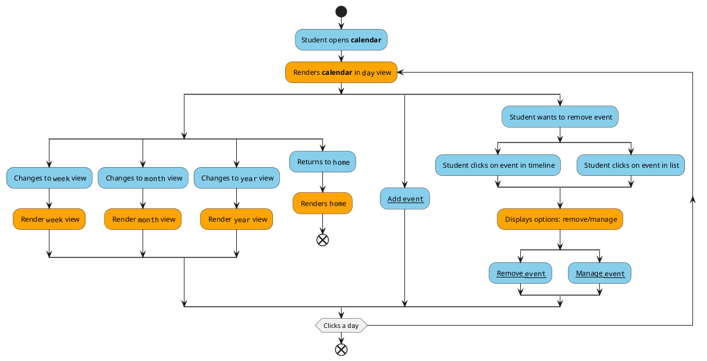

# Calendar 

* **Level**: User goal

* **Primary actor**: User (student)

* **Stakeholders and interests**:

  -- **Student (average user)**: Wants to be able to utilize the calendar to view 
  when upcoming club meeting and events are

  -- **Club executives**: Use the calendar to effectively plan out events and meetings
  to avoid time conflicts with GB members

* **Preconditions**:

  -- User is authenticated and logged in to the application

* **Postconditions**: 

  -- Calendar is correctly rendered with user's upcoming events and meetings 

  -- Users can successfully add and remove events and meetings from the calendar

  -- Users can filter which events and meetings 

* **Non-functional requirements**
  
  --Usability: user needs to have an Android device that is compatible with the application

  --Performance: Search and filter processes should be under 1-2 seconds within 95% of the time and calendar should render and update around similar time.

  --Supportability: Date, text, number formatting should be internalized

    

Blue: User, Orange: System
