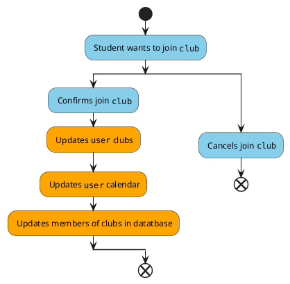

Blue: User, Orange: System

```plantuml
@startuml
start
#SkyBlue: Student wants to join ""club"";
split
#SkyBlue: Confirms join ""club"";
#Orange: Updates ""user"" clubs;
#Orange: Updates ""user"" calendar;
#Orange: Updates members of clubs in datatbase;
split again
#SkyBlue: Cancels join ""club"";
end
endsplit
end
@enduml
```
