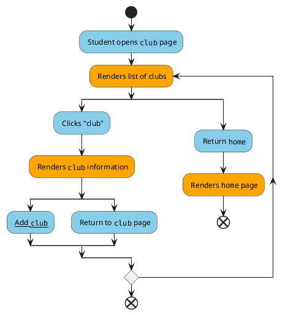

# Clubs

* **Level**: User goal

* **Primary actor**: User (student)

* **Stakeholders and interests**:

  -- **Student (average user)**: Has the ability to browse clubs and add a club.

* **Preconditions**:

  -- User is authenticated and logged in to the application

* **Postconditions**:

  -- Users can view the list of all clubs

  -- Users can successfully add a club

* **Non-functional requirements**

  --Usability: User needs to have an Android device that is compatible with the application

  --Performance: Viewing and adding clubs should run below 2 second within 95% of the time

  --Supportability: Text formatting should be internalized

Blue: User, Orange: System

