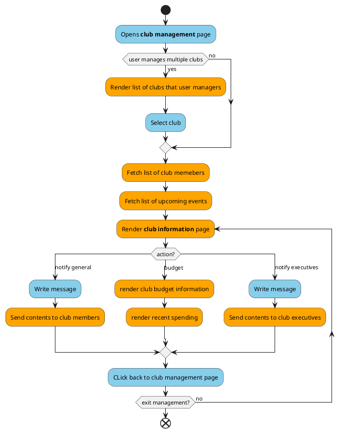

Blue: User, Orange: System

```plantuml
@startuml
start
#SkyBlue:Opens **club management** page;
if (user manages multiple clubs) then (yes)
    #Orange:Render list of clubs that user managers;
    #SKyBlue:Select club;
else (no)
endif
#Orange:Fetch list of club memebers;
#Orange:Fetch list of upcoming events;
#Orange:repeat:Render **club information** page;
switch (action?)
    case (notify general)
        #SkyBlue:Write message;
        #Orange:Send contents to club members;
    case (budget)
        #Orange:render club budget information;
        #Orange:render recent spending;
    case (notify executives)
        #SkyBlue:Write message;
        #Orange:Send contents to club executives;
endswitch
#SkyBlue:CLick back to club management page;
repeat while (exit management?) is (no)
end


@enduml
```