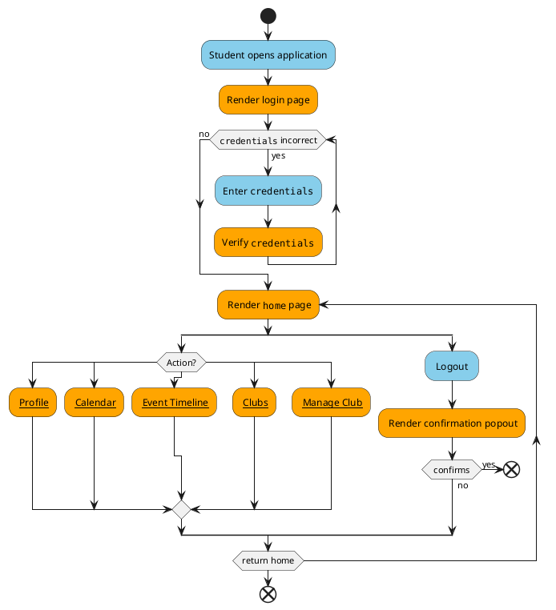

Blue: User, Orange: System

```plantuml
@startuml
start
#SkyBlue:Student opens application;
#Orange:Render login page;
while (""credentials"" incorrect) is (yes)
    #SkyBlue:Enter ""credentials"";
    #Orange:Verify ""credentials"";
endwhile (no)
#Orange:repeat: Render ""home"" page;
split
  switch (Action?)
    case ()
        #Orange: __Profile__;
    case ()
        #Orange: __Calendar__;
    case ()
        #Orange: __Event Timeline__;
    case ()
        #Orange: __Clubs__;
    case ()
        #Orange: __Manage Club__;
  endswitch
split again
#SkyBlue: Logout ;
#Orange: Render confirmation popout;
if ( confirms ) then (yes)
end
else ( no )
endif 
endsplit
repeat while (return home)
end
@enduml
```