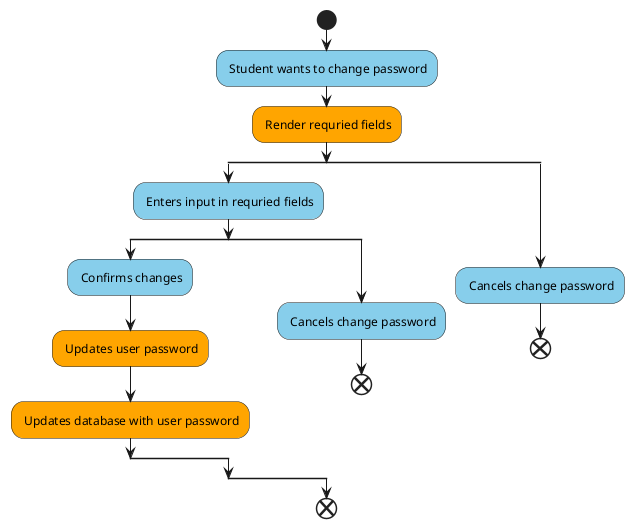

Blue: User, Orange: System

```plantuml
@startuml
start
#SkyBlue: Student wants to change password;
#Orange: Render requried fields;
split
#SkyBlue: Enters input in requried fields;
split
#SkyBlue: Confirms changes;
#Orange: Updates user password;
#Orange: Updates database with user password;
split again
#SkyBlue: Cancels change password;
end
endsplit
splitagain
#SkyBlue: Cancels change password;
end
endsplit
end
@enduml
```