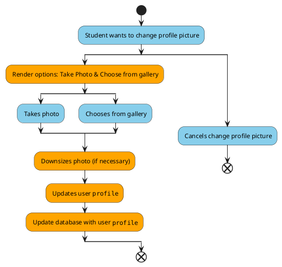

```plantuml
@startuml
start
#SkyBlue: Student wants to change profile picture;
split
#Orange: Render options: Take Photo & Choose from gallery;
split
#SkyBlue: Takes photo;
split again
#SkyBlue: Chooses from gallery;
endsplit
#Orange: Downsizes photo (if necessary);
#Orange: Updates user ""profile"";
#Orange: Update database with user ""profile"";
split again
#SkyBlue: Cancels change profile picture;
end
endsplit
end
@enduml
```