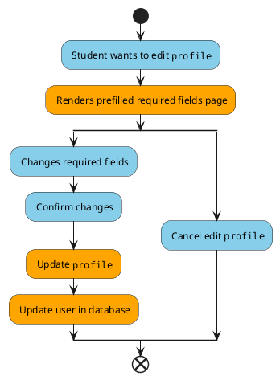

Blue: User, Orange: System

```plantuml
@startuml
start
#SkyBlue: Student wants to edit ""profile"";
#Orange: Renders prefilled required fields page;
split
#SkyBlue: Changes required fields;
#SkyBlue: Confirm changes;
#Orange: Update ""profile"";
#Orange: Update user in database;
split again
#SkyBlue: Cancel edit ""profile"";
end split
end
@enduml
```