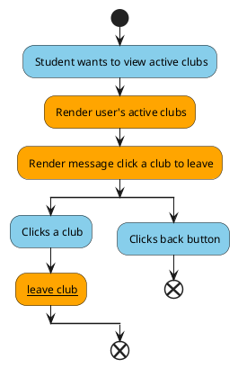

Blue: User, Orange: System

```plantuml
@startuml
start
#SkyBlue: Student wants to view active clubs;
#Orange: Render user's active clubs;
#Orange: Render message click a club to leave;
split
#SkyBlue: Clicks a club;
#Orange: __leave club__;
splitagain
#SkyBlue: Clicks back button;
end
endsplit
end
@enduml
```