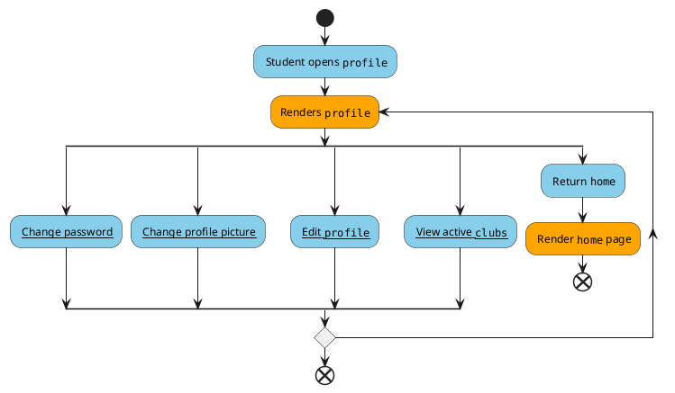

# Profile

* **Level**: User goal

* **Primary actor**: User (student)

* **Stakeholders and interests**:

  -- **Student (average user)**: To manage their active clubs and general information(nickname and pronouns)

  -- **Club executives**: Has the ability to get in contact with users that are interested in their club/s

* **Preconditions**:

  -- User is authenticated and logged in to the application

* **Postconditions**:

  -- Users can modify their nickname, pronouns and profile picture

  -- Users can successfully view their active clubs and join or leave a club

* **Non-functional requirements**

  --Usability: User needs to have an Android device that is compatible with the application

  --Performance: Checking validity of user changes, processing and updating user changes, adding and removing clubs should run below 2 second within 95% of the time 

  --Supportability: Text formatting should be internalized

Blue: User, Orange: System
