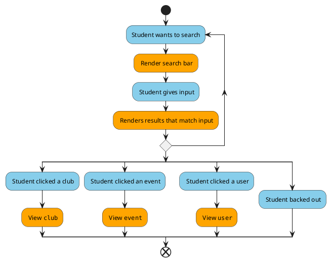

# Profile

* **Level**: User goal

* **Primary actor**: User (student)

* **Stakeholders and interests**:

  -- **Student (average user)**: To search for clubs, events and other student's profiles

* **Preconditions**:

  -- User is authenticated and logged in to the application

* **Postconditions**:

  -- Users can search for clubs, events and users.

  -- Users can successfully view their search results

* **Non-functional requirements**

  --Usability: User needs to have an Android device that is compatible with the application

  --Performance: Searching should run below 2 second within 95% of the time

  --Supportability: Text formatting should be internalized

Blue: User, Orange: System
